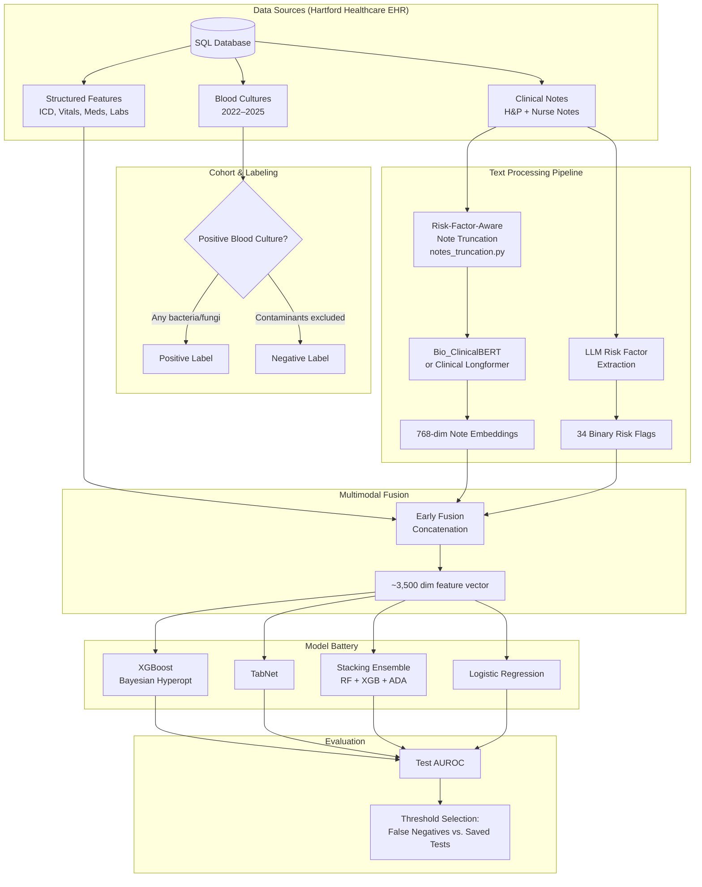
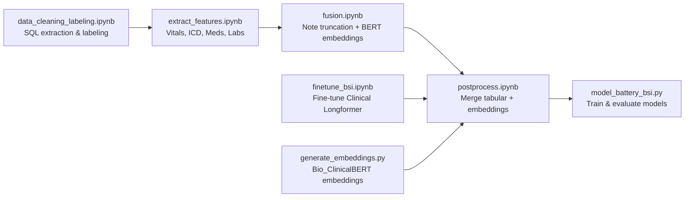

# Multimodal Early Bloodstream Infection Detection

**Authors:** Seehanah Tang, Carol Gao
**Course:** Multimodal AI (MAS.S60 / 6.S985), MIT Spring 2026
**Dataset:** Hartford Healthcare EHR (in collaboration with Hartford Healthcare)

---

## Overview

Bloodstream infections (BSIs) are life-threatening hospital events affecting ~500,000 US patients yearly with a ~9% incidence among blood cultures drawn. Definitive diagnosis requires blood cultures with a 1–3 day turnaround, delaying treatment. We build a multimodal AI framework for **early BSI prediction** by fusing structured EHR data (vitals, diagnoses, medications) with unstructured clinical notes, enabling risk stratification at the time of blood culture order.

---

## Dataset

| Attribute | Value |
|-----------|-------|
| Source | Hartford Healthcare (Hartford Hospital) |
| Period | January 2022 – December 2025 |
| Unique encounters | ~150,956 |
| Positive rate (overall) | ~9.2% |
| Train split | 2022–2024 |
| Test split | 2025 |
| ED cohort (train / test) | 31,760 / 4,744 |

**Positive rate by year:**

| Year | N | Positive Rate |
|------|---|---------------|
| 2022 | 44,963 | 8.8% |
| 2023 | 45,766 | 8.6% |
| 2024 | 39,603 | 9.2% |
| 2025 | 20,624 | 9.4% |

**Input modalities:**

| Modality | Description | Representation |
|----------|-------------|----------------|
| ICD-10 codes | All prior diagnoses | Binary flags (~2,000+ codes) |
| Vitals | HR, SpO2, RR, Temp, AMS | Aggregated numeric values |
| Chief complaints | Presenting complaint at admission | Binary flags |
| Medications | All prior prescribed medications | Binary/count flags |
| Labs | Lactic acid, INR, P/F ratio, etc. | Numeric |
| Extracted risk factors | 34 BSI risk factors (e.g., central line, immunocompromised) | Binary/count via LLM extraction |
| Clinical notes | 5 most recent H&P and nurse notes | 768-dim embeddings |

---

## System Architecture



---

## Data Pipeline



---

## Research Questions

### RQ1: Do context-specific models outperform a global model?

**Hypothesis:** BSI risk manifests differently across care settings (ED, inpatient, ICU). Population-specific models should outperform a single global model.

**Approach:**
- Train a global model on all Hartford Hospital patients
- Train separate models for ED, surgical inpatients, and ICU patients
- Compare AUROC and calibration across cohorts

**Status:** Experiments run on ED cohort. Results pending.

---

### RQ2: Does multimodal fusion improve over single-modality baselines?

**Hypothesis:** Clinical notes contain contextual cues and clinical suspicion that complement objective physiological data; their combination yields substantial performance gains.

**Feature combinations tested:**

| Experiment | Features |
|------------|---------|
| Tabular only | ICD + Vitals + Meds + Labs + Chief Complaints |
| Notes only | Bio_ClinicalBERT 768-dim embeddings |
| Risk factors | 34 LLM-extracted BSI risk flags |
| Multimodal (concat) | Tabular + Notes embeddings |
| Multimodal + Risk | Tabular + Notes + Risk Factors |
| Ablations | No Meds / No Keywords / No Notes / etc. |

**Two text representations compared:**
1. **Bio_ClinicalBERT** (pretrained, chunked): mean-pooled embeddings over 512-token chunks
2. **Clinical Longformer** (fine-tuned on BSI): full-context embeddings up to 4,096 tokens

**Status:** Feature ablations and multimodal experiments complete. Results pending.

---

### RQ3: Can xHAIM-style explanations support clinical trust? *(Next steps)*

Apply the xHAIM framework (Petridis et al., 2026) to generate:
- Feature importance for structured inputs
- Highlighted note text contributing to risk prediction
- Clinically coherent LLM-generated explanations synthesizing both

---

## Text Processing Details

### Risk-Factor-Aware Note Truncation (`notes_truncation.py`)

Rather than naively truncating notes at a token limit, we filter notes to sentences relevant to BSI risk:

- **34 clinical risk factors** defined (e.g., immunocompromised state, central line, fever, altered mental status)
- **160+ relevance keywords** covering conditions, devices, vitals, exposures, and clinical suspicion phrases
- Boilerplate sections removed (social history, attestation statements, documentation artifacts)
- Output: up to 50 most relevant sentences per patient, reducing noise before embedding

```
Raw clinical note (often 2,000+ words)
         ↓  notes_truncation.py
Filtered to BSI-relevant sentences (~200–500 words)
         ↓  Bio_ClinicalBERT / Clinical Longformer
768-dimensional embedding
```

### Bio_ClinicalBERT Embedding (`generate_embeddings.py`)

- **Model:** `emilyalsentzer/Bio_ClinicalBERT`
- **Chunking:** Notes tokenized and split into 512-token chunks; each chunk independently embedded; mean-pooled to a single 768-dim vector
- **Scale:** ~43,000 patients embedded per run (~7 min on GPU)

### Clinical Longformer Fine-tuning (`finetune_bsi.ipynb`)

- **Model:** `allenai/clinical-longformer` (4,096 token context)
- **Task:** Binary classification (positive blood culture)
- **Split:** Patient-level 80/20 train/val
- **Output:** Both 768-dim embeddings and predicted BSI probability per patient

---

## Model Details

### XGBoost (Primary Model)

Bayesian hyperparameter search (`BayesSearchCV`, 10 iterations, 3-fold CV):

| Hyperparameter | Search Range |
|---------------|-------------|
| `n_estimators` | 100–2,000 |
| `max_depth` | 0–50 |
| `learning_rate` | 0.01–0.1 (log-uniform) |
| `min_child_weight` | 0–10 |
| `subsample` | 0.5–1.0 |
| `colsample_bytree` | 0.5–1.0 |

Class imbalance handled via `compute_sample_weight(class_weight='balanced')`.

### TabNet

Attentive transformer-based tabular model with:
- Categorical column handling for ICD/medication flags
- 5-fold CV to determine optimal training epochs (early stopping patience = 20)
- Balanced class weights (`weights=1`)

### Stacking Ensemble

Meta-learner: `GradientBoostingClassifier`
Base models: Random Forest + XGBoost + AdaBoost

---

## Results

*Results to be filled in after experiments complete.*

### RQ1: Global vs. Context-Specific Models

| Cohort | Model | AUROC | Notes |
|--------|-------|-------|-------|
| All patients (global) | XGBoost | — | |
| ED only | XGBoost | — | |
| Inpatient | XGBoost | — | |
| ICU | XGBoost | — | |

### RQ2: Multimodal Fusion Ablation

| Features | Model | AUROC |
|----------|-------|-------|
| Tabular only | XGBoost | — |
| Notes only (BioClinicalBERT) | XGBoost | — |
| Notes only (Longformer fine-tuned) | XGBoost | — |
| Risk factors only | XGBoost | — |
| Tabular + Notes (concat) | XGBoost | — |
| Tabular + Notes + Risk factors | XGBoost | — |

### Clinical Impact (at selected threshold)

| Metric | Value |
|--------|-------|
| False negatives (missed BSIs) | — |
| Saved blood cultures | — |
| Reduction in unnecessary cultures vs. current policy | — |

---

## File Reference

| File | Purpose |
|------|---------|
| `data_cleaning_labeling.ipynb` | SQL extraction from Hartford Healthcare, cohort construction, blood culture labeling (positive/negative/false-positive logic) |
| `extract_features.ipynb` | Structured feature extraction: vitals, ICD-10, medications, chief complaints, labs, demographic aggregation |
| `generate_embeddings.py` | Bio_ClinicalBERT embedding generation with chunked tokenization and mean pooling |
| `notes_truncation.py` | Risk-factor-aware clinical note filtering utility |
| `finetune_bsi.ipynb` | Clinical Longformer fine-tuning for BSI classification and embedding extraction |
| `fusion.ipynb` | Note truncation → embedding pipeline; merges text embeddings with tabular features |
| `postprocess.ipynb` | Final dataset merging and preprocessing before model training |
| `models.py` | Model definitions: XGB (Bayesian search), TabNet (CV), stacking, LR, MLP |
| `model_battery.py` | Runs LR/MLP/XGB across all feature combinations; saves predictions, importances |
| `model_battery_bsi.py` | BSI-specific runner with XGB, TabNet, stacking; produces per-experiment reports |

---

## References

- Petridis et al. (2026). *Holistic AI in medicine: improved performance and explainability.* npj Digital Medicine.
- Soenksen et al. (2022). *Integrated multimodal artificial intelligence framework for healthcare applications.* NPJ digital medicine.
- Tabak et al. (2018). *Blood Culture Turnaround Time in U.S. Acute Care Hospitals.* Journal of Clinical Microbiology.
- Singer et al. (2016). *The Third International Consensus Definitions for Sepsis and Septic Shock (Sepsis-3).* JAMA.
